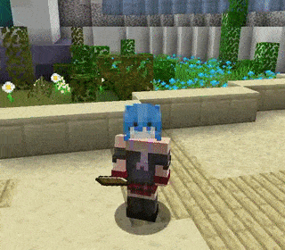
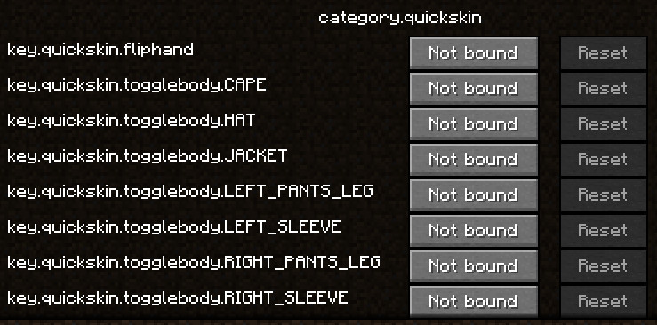

# Quickskin
  
Minecraft Fabric mod for flipping hand position and toggling skin parts using a keybind.  
**NOTE:** On some servers with a custom protocol implementations or plugins this might not work or be delayed (e.g. Hypixel takes a long time to update the skin settings)

## Instalation
Go to [the Releases tab](https://github.com/Ryhon0/quickskin/releases) and download the `.jar` file. Make sure you have Fabric and Fabric API installed and put the `.jar` file into the `.minecraft/mods` directory.  
If there's no release for your version, you have to build it yourself.  

Alternativelly you can build it yourself.  
Clone the repository, run `./gradlew publishToMavenLocal` to generate a `.jar` file. The `.jar` file will be located in `./build/libs/`. Copy that file to your `.minecraft/mods` folder.  
Make sure you're using JDK 17 because 19 doesn't work, apparently 🤓.  

This mod was made for Minecraft 1.16.1, if you want it for a different version of Minecraft, fill out the [gradle.properties](gradle.properties) file with information from [here](https://modmuss50.me/fabric.html).

Feel free to fork this project and add new features.

## Licenses
[GPL-3.0 License](LICENSE)  
[Key icon by Dream Mix](https://dreammix.itch.io/keyboard-keys-for-ui)